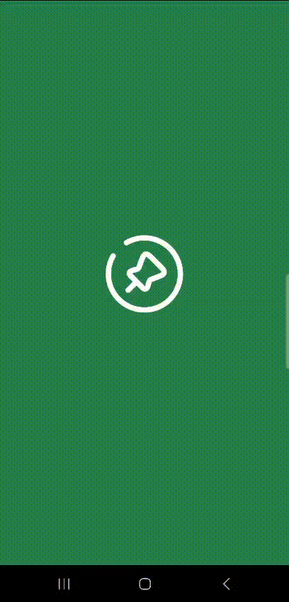

# 🗺️ NEARBY

Nearby is a mobile application that allows its users to find restaurants, cinemas, stores and other places closest to their location. The application was developed using the city of São Paulo as an example, for residents near Paulista Avenue. By clicking on the location, the user can read information about it and read a QR Code, in this case present at the establishment, to obtain discounts through a coupon.

## 🤖 PROTOTYPE




## 📒 FEATURES

 - Using React Native to Development
 - Componentization
 - Routes
 - Backend Integration


## 🛠️ Run the Project


* Before the commands to install the app, I recommend install the latest version of [Node](https://nodejs.org/) in your machine and the [Expo](https://play.google.com/store/apps/details?id=host.exp.exponent&hl=en-US) in your phone to see the project, and [VsCode](https://code.visualstudio.com/) in your compute to execute the commands in your integrate terminal.

### 📱 Backend configuration

* To install the backend in your machine, run the command bellow: 

```bash
    git clone https://github.com/devnestali/nearby-backend.git
```

* To install Node dependencies in Node Modules folder: 

```bash
    npm install
```

* Finally, run the command bellow to run your backend: 
```bash
  npm start
```

### 📱 Frontend configuration

* To install the frontend in your machine, run the command bellow: 

```bash
    git clone https://github.com/devnestali/nearby.git
```

* After install [Expo](https://play.google.com/store/apps/details?id=host.exp.exponent&hl=en-US) in your phone, run the command in your terminal: 

```bash
    npx expo start 
```

* On your terminal, you'll see an **QRCode**, with your phone's camera read the QRCode to access the app in your phone and enjoy the app 😁


* **IMPORTANT**: Don't forget to change the baseURL in api file to the IP Address in your machine -> **http://<IP adress>:3333**
## 🚀 License

**[@devnestali]('https://github.com/devnestali') - Software Engineering and FullStack Developer**


All rights reserved by **Rocketseat** 

**I HOPE YOU ENJOY** 😀
